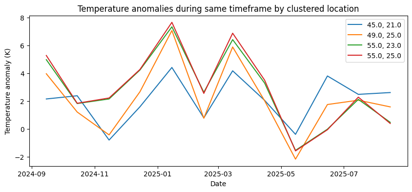
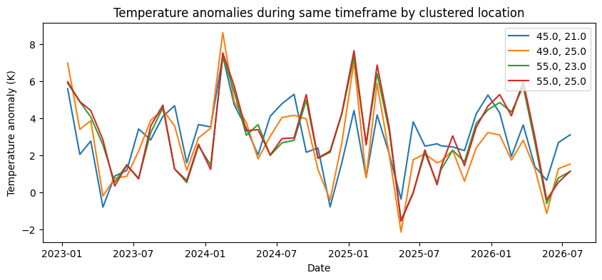
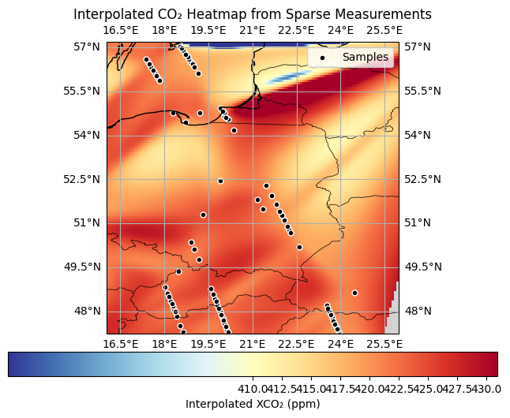
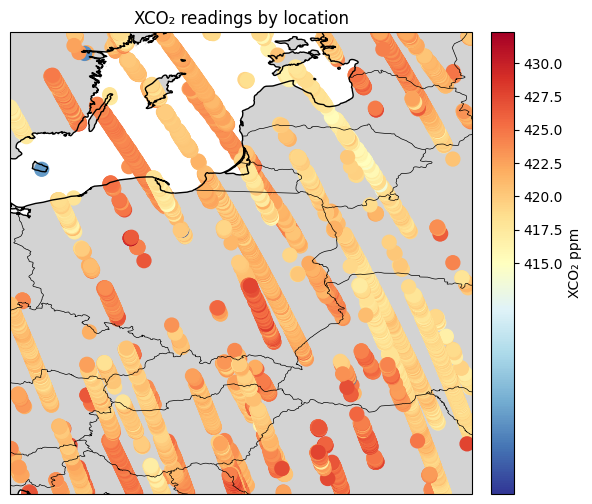
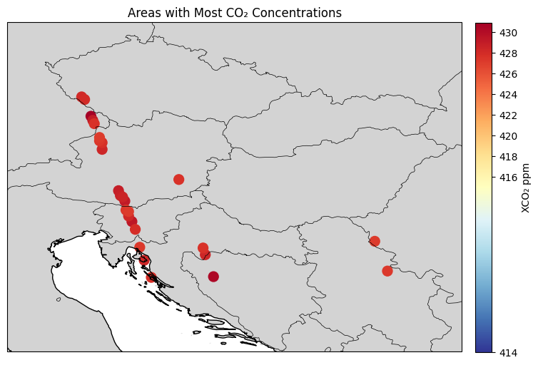
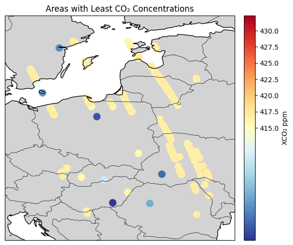
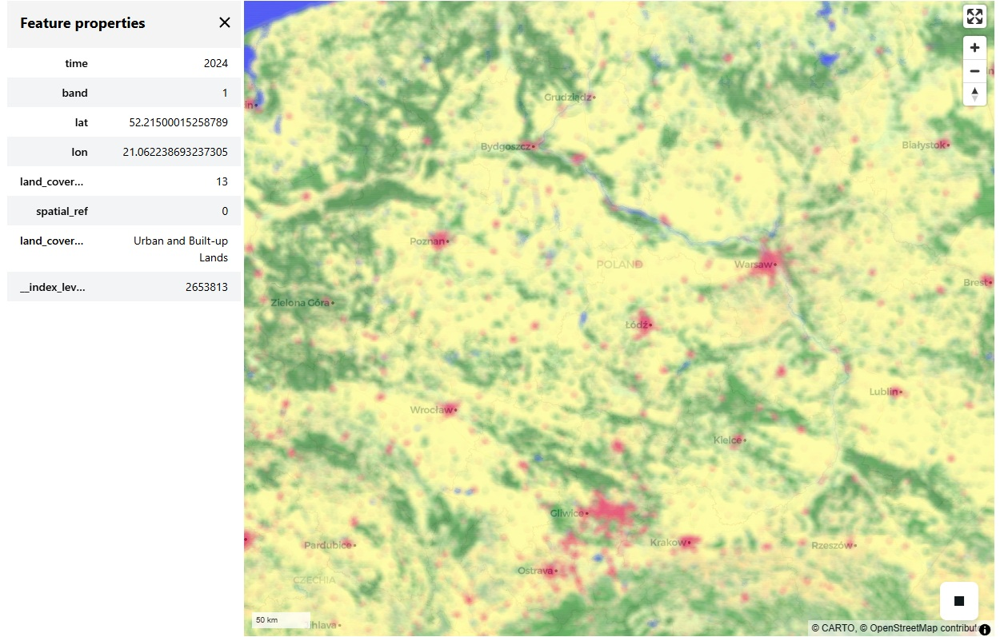
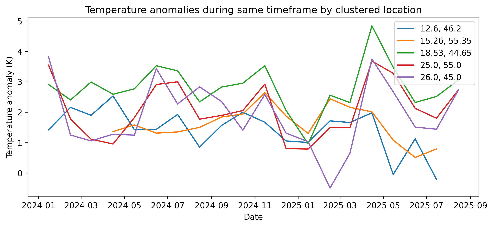

# Climate Analysis Project

Python project for analyzing atmospheric CO₂ and surface temperature anomalies, predicting future statistic. It reads raw and processed datasets, creates combined dataframes, generates visualizations for climate research and exploration, trains a **Gradient Boosting regression** to predict future temperature anomalies.

## Data Sources

[OCO2 GES DISC, NASA L2](https://disc.gsfc.nasa.gov/datasets/OCO2_L2_Standard_11r/summary) : Column-averaged CO₂ (XCO₂) measurements with temporal and geospatial metadata. The data was transformed from HDF5 format into a processable dataframe for analysis.

[MODIS Land Cover Type (MCD12Q1)](https://www.earthdata.nasa.gov/data/catalog/lpcloud-mcd12q1-061) : Global land cover types at yearly intervals with geospatial metadata using supervised classifications of MODIS Terra and Aqua reflectance data.

[GISTEMP, NASA](http://data.giss.nasa.gov/gistemp/) : Surface temperature anomalies with temporal and geospatial metadata. Values are expressed in K.

## Machine Learning — Gradient Boosting Regression

A Gradient Boosting regression model was trained to predict future surface temperature anomalies using historical temperature anomalies, column‑averaged CO₂ (XCO₂) levels, and MODIS land cover types as input features. The analysis and model-building are implemented in the notebook `ml_data_analysis.ipynb` and use `scikit‑learn` for modeling and evaluation.

Model experiments, parameters, metrics, and artifacts are tracked with MLflow and can be inspected via the MLflow UI.

- Notebook: `notebooks/ml_data_analysis.ipynb`  
- Inputs: historical anomalies, XCO₂, land cover features
- Model: `GradientBoostingRegressor` (`scikit-learn`) with hyperparameter search and validation  
- Tracking: MLflow (default store: `./notebooks/mlruns`)  
- To view results: run `mlflow ui --backend-store-uri ./notebooks/mlruns --port 5000` and open http://localhost:5000

Trained model artifacts and exported model files are saved with the experiment artifacts (see MLflow UI for locations and detailed run metadata).

| Historical Temperature Anomalies | Predicted Temperature Anomalies | Historical & Predicted |
|:-----------------------------------:|:-----------------------------------:|:-----------------------------------:|
|  |  |  |
| Timeframe: 12 months | Timeframe: 12 months (historical anomalies, XCO₂, land cover features) | More global overview. Timeframe: 44 months |

## Visualizations

### OCO2 CO₂ measurements

Several visualizations are generated from OCO2 CO₂ measurements:

| Interpolated CO₂ Heatmap from Sparse Measurements | XCO₂ Readings |
|:-----------------------------------:|:-----------------------------------:|
|  |  |
| Shows interpolated XCO₂ levels with circles indicating actual satellite measurement locations. | Shows XCO₂ levels indicating actual satellite measurement locations. |

| Areas with Highest CO₂ Concentrations | Areas with Lowest CO₂ Concentrations |
|:-----------------------------------:|:-----------------------------------:|
|  |  |
| Areas with Highest CO₂ Concentrations (>425 ppm) | Areas with Lowest CO₂ Concentrations (<417 ppm) |

XCO₂ represents the column-averaged CO₂ concentration from ground to upper atmosphere (~60km), measured in parts per million (ppm).

Data exploration notebooks in `co2_data_exploration/` download and process NASA L2 `nc4` files (2024-2025 satellite readings) with configurable data volume limits.
Processed data optionally exported to `data/processed/co2.parquet` after cell execution.

### MODIS Land Cover Type

Data exploration notebooks in `land_type_exploration/` download and process MODIS `hdf` files (2024-2025 satellite readings). Processed data optionally exported to `data/processed/land_cover_types.parquet` after cell execution.

| Land Cover Types | Land Cover Types Interactive Map |
|:-----------------------------------:|:-----------------------------------:|
|  |  |
| Static land cover projection with `matplotlib`, `cartopy`, `geopandas` | Detailed exploration of land cover types using `lonboard`, `geopandas` |

### Temperature anomalies by region

Temperature anomaly data is clustered by geographic proximity using the **K-Means algorithm**. Locations within a user-specified latitude/longitude range are grouped into a configurable number of clusters (default: 5). This allows for exploration of regional anomaly patterns over time.  

The figure legend indicates the approximate geographic centroid of each cluster.

Data exploration notebooks in `tempanomalies_exploration/` download and process GISTEMP `nc` files (2024-2025 satellite readings). Processed data optionally exported to `data/processed/tempanomalies.parquet` after cell execution.

## How to run

### Environment Setup

Prerequisites:

- Conda package manager
- Create environment from file: `conda env create -f environment.yml`
- Activate environment: `conda activate climate_analysis`

### Run the CLI entrypoint (main.py)

Typical usage:

- From project root:
  - `python src/main.py`  
  - Example with common options:  
        `python src/main.py --year-range 5 --lon -122.4194 --lat 37.7749 --loc-range 10`

Notes:

- Run `python src/main.py --help` to see all supported arguments
- Key arguments:
  - `--year-range`: Number of years to analyze (default: 1)
  - `--lon`: Longitude coordinate to center analysis (optional)
  - `--lat`: Latitude coordinate to center analysis (optional)
  - `--loc-range`: Range in degrees around location coordinates (default: 10)
- Output figures are written to `outputs/plots/` by default

### Run Jupyter notebooks / JupyterLab

Prerequisites:

- JupyterLab is included in environment.yml
- Ensure conda environment is activated: `conda activate climate_analysis`

Start JupyterLab with the project config:

- From project root:
  - `jupyter lab --config=.jupyter/jupyter_lab_config.py`
